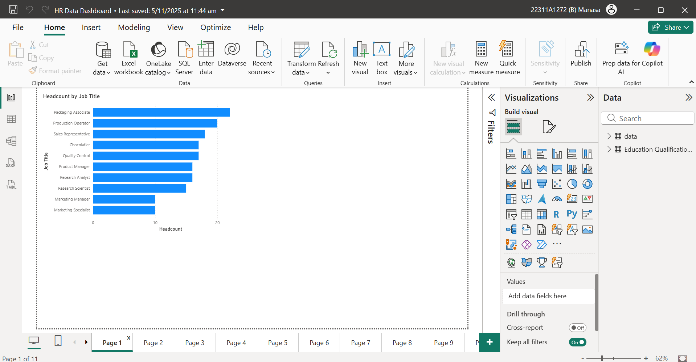
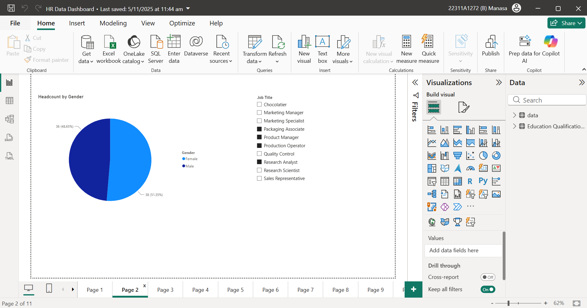
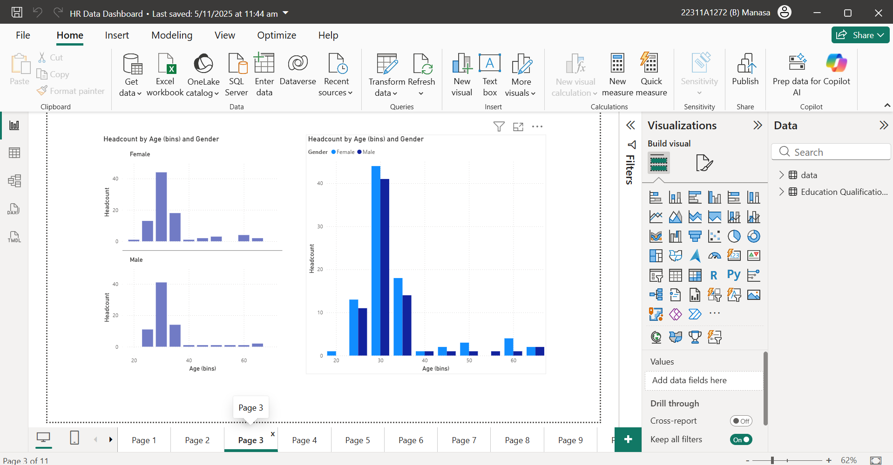
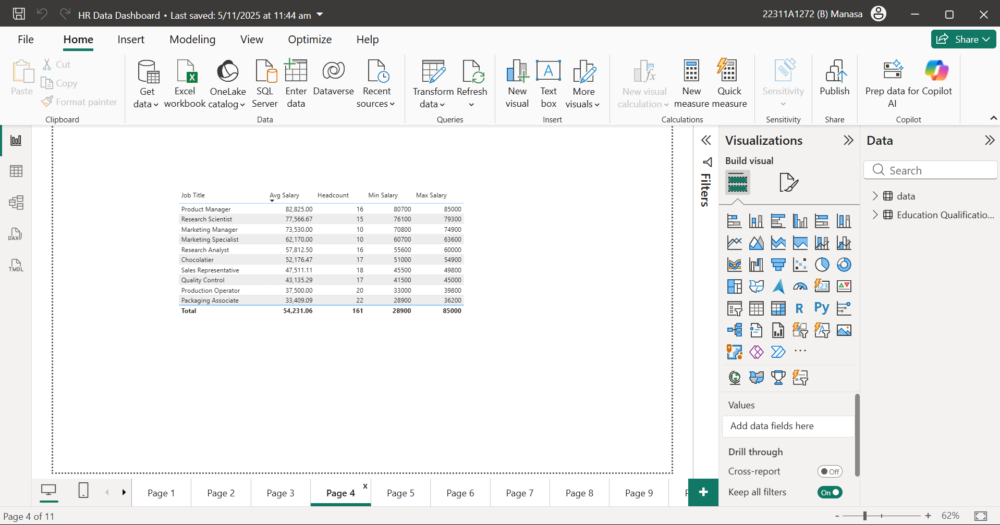
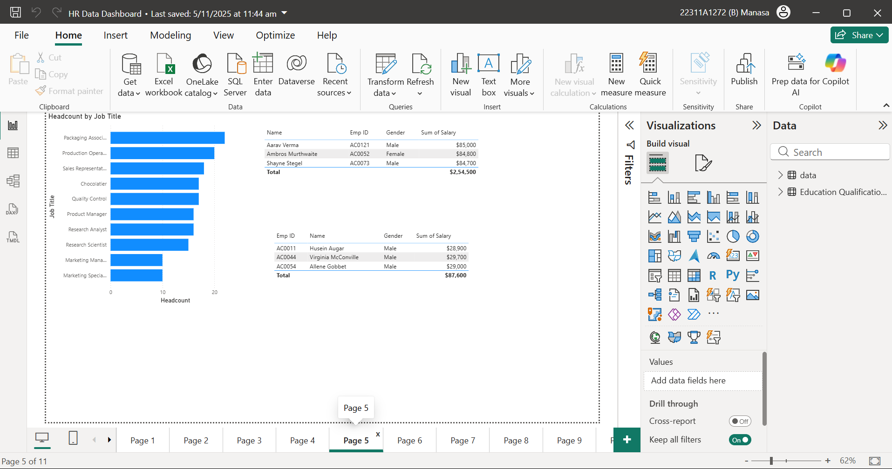
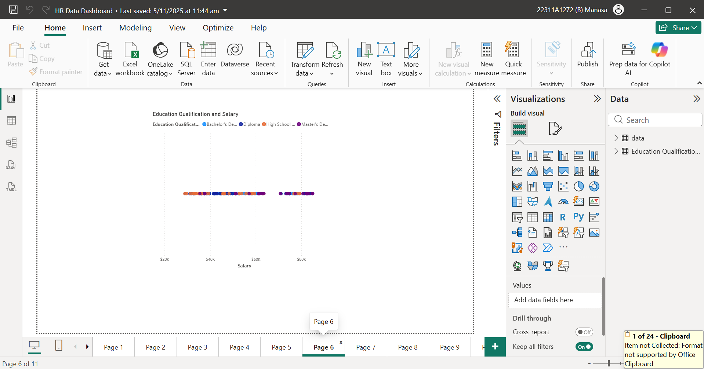
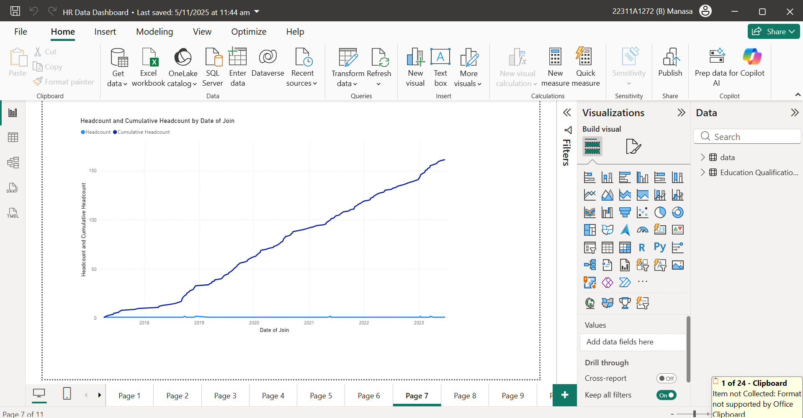
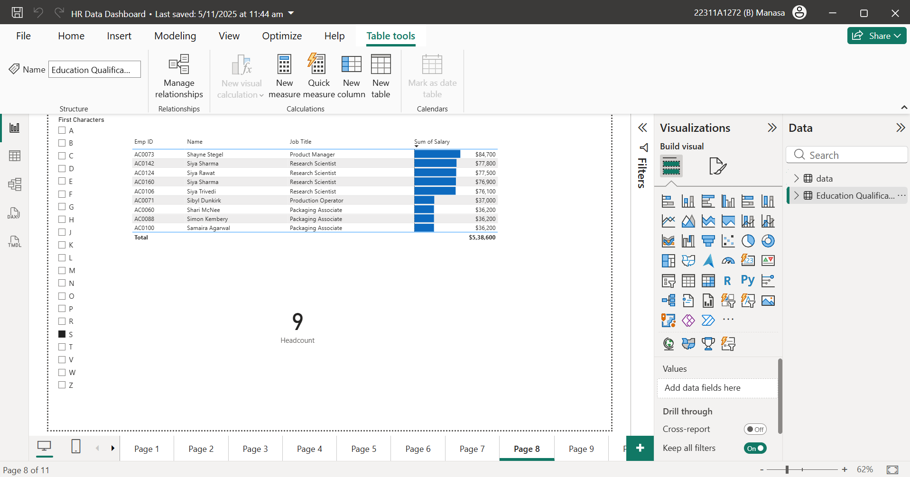
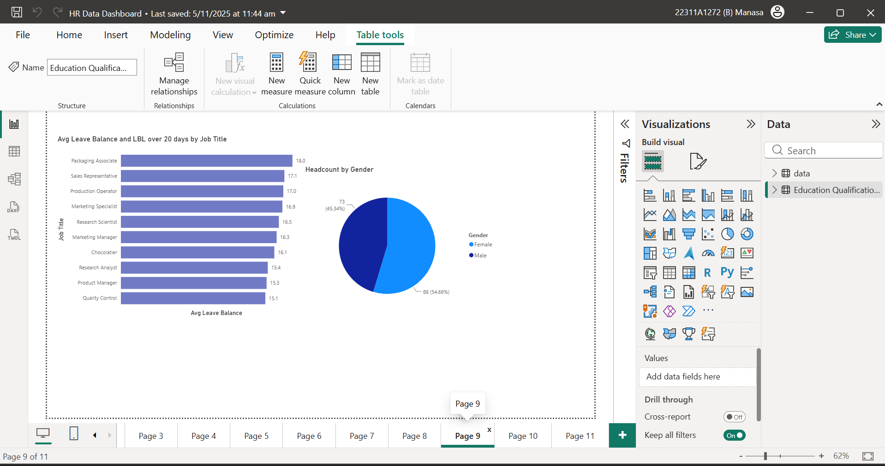
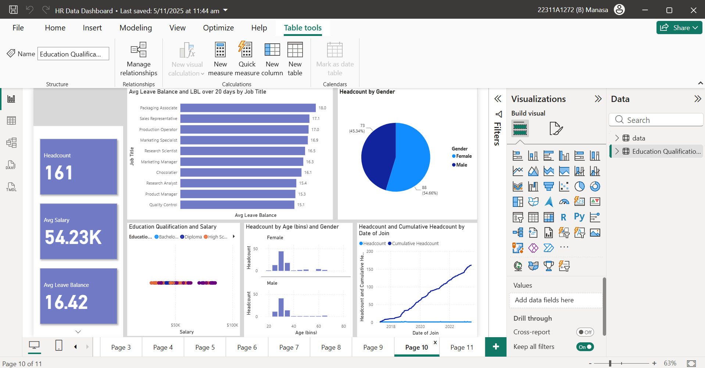

# HR Analytics Dashboard using Power BI

## Live Dashboard

Explore the interactive Power BI dashboard here:

[View Live Dashboard](https://app.powerbi.com/links/LR3towkH0c?ctid=98f2531c-ef28-4c7d-a0bb-68624c1fdcc0&pbi_source=linkShare)

## Overview

This project focuses on analyzing employee data to generate meaningful HR insights using Power BI. The dashboard helps understand workforce distribution, salary patterns, employee growth, qualifications, and leave balances.

The objective is to provide HR teams with data-driven insights for better workforce planning and decision-making.

---

## Problem Statement

Managing employee data manually makes it difficult to identify trends, salary distribution, workforce demographics, and growth patterns.

This dashboard aims to solve that by providing:

* Workforce distribution analysis
* Salary insights across job roles
* Employee qualification analysis
* Leave balance tracking
* Staff growth trends over time

---

## Dataset Information

The dataset contains employee records including:

* Employee ID
* Gender
* Education Qualification
* Date of Joining
* Job Title
* Salary
* Age
* Leave Balance

---

## Tools Used

* Power BI
* Microsoft Excel

---

## Dashboard Insights

### 1. Job Distribution

Analyzes how employees are distributed across different job roles.

---

### 2. Gender Breakdown

Provides gender-wise employee distribution.

---

### 3. Age Distribution

Shows employee age spread across the organization.

---

### 4. Salary by Job Role

Compares salary variations across different positions.

---

### 5. Top Earners by Job

Identifies highest-paid employees in each job category.

---

### 6. Qualification vs Salary

Analyzes salary differences based on education qualifications.

---

### 7. Staff Growth Trend

Tracks employee growth over time.

---

### 8. Employee Filter Analysis

Allows filtering employees based on starting letter.

---

### 9. Leave Balance Analysis

Provides leave balance insights across employees.

---

### 10. Quick HR Dashboard

A summary dashboard for quick HR insights.

---

## Key Skills Demonstrated

* Data Cleaning
* Data Visualization
* Dashboard Design
* HR Data Analysis
* Business Intelligence
* KPI Tracking
* Interactive Reporting

---

## Business Impact

This dashboard helps HR teams:

* Monitor workforce distribution
* Identify salary trends
* Track employee growth
* Improve workforce planning
* Analyze leave utilization
